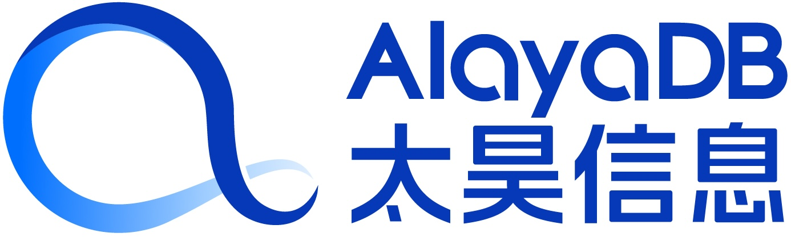
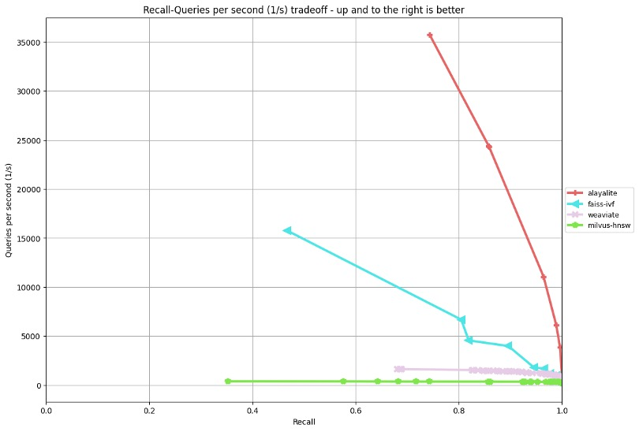
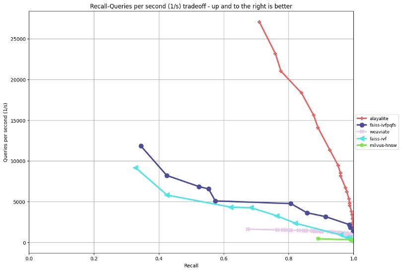

<p align="center">
  <a href="https://github.com/AlayaDB-AI"></a>
</p>


<p align="center">
    <b>AlayaLite – A Fast, Flexible Vector Database for Everyone</b>. <br />
    Seamless Knowledge, Smarter Outcomes.
</p>


<p align="center">


</p>

## Features

- **High Performance**: Modern vector techniques integrated into a well-designed architecture. 
- **Elastic Scalability**: Seamlessly scale across multiple threads, which is optimized by C++20 coroutines.
- **Adaptive Flexibility**: Easy customization for quantization methods, metrics, and data types.
- **Ease of Use**: [Intuitive APIs](./pyalaya/README.md) in Python.


## Getting Started!

Get started with just one command!
```bash
pip install alayalite # install the python package.
```


Access your vectors using simple APIs.
```python
from alayalite import Client, Index
from alayalite.utils import calc_recall, calc_gt
import numpy as np

# Initialize the client and create an index. The client can manage multiple indices with distinct names.
client = Client() 
index = client.create_index("default")

# Generate random vectors and queries, then calculate the ground truth top-10 nearest neighbors for each query.
vectors = np.random.rand(1000, 128).astype(np.float32)
queries = np.random.rand(10, 128).astype(np.float32)
gt = calc_gt(vectors, queries, 10)

# Insert vectors to the index
index.fit(vectors)

# Perform batch search for the queries and retrieve top-10 results
result = index.batch_search(queries, 10)

# Compute the recall based on the search results and ground truth
recall = calc_recall(result, gt)
print(recall)
```

## Benchmark

We evaluate the performance of AlayaLite against other vector database systems using [ANN-Benchmark](https://github.com/erikbern/ann-benchmarks) (compile locally and open `-march=native` in your `CMakeLists.txt` to reproduce the results). Several experimental results are presented below.

<table style="border-collapse: collapse; border: none;">
  <tr>
    <td style="border: none;"></td>
    <td style="border: none;"></td>
  </tr>
  <tr>
    <td style="text-align: center; font-weight: bold; border: none;">GloVe-25 Angular</td>
    <td style="text-align: center; font-weight: bold; border: none;">SIFT-128 Euclidean</td>
  </tr>
</table>

## Contributing

We welcome contributions to AlayaLite! If you would like to contribute, please follow these steps:

1. Start by creating an issue outlining the feature or bug you plan to work on.
2. We will collaborate on the best approach to move forward based on your issue.
3. Fork the repository, implement your changes, and commit them with a clear message.
4. Push your changes to your forked repository.
5. Submit a pull request to the main repository.

Please ensure that your code follows the coding standards of the project and includes appropriate tests.

## Acknowledgements

We would like to thank all the contributors and users of AlayaLite for their support and feedback.

## Contact

If you have any questions or suggestions, please feel free to open an issue or contact us at **dev@alayadb.ai**.


## License

[Apache 2.0](./LICENSE)
