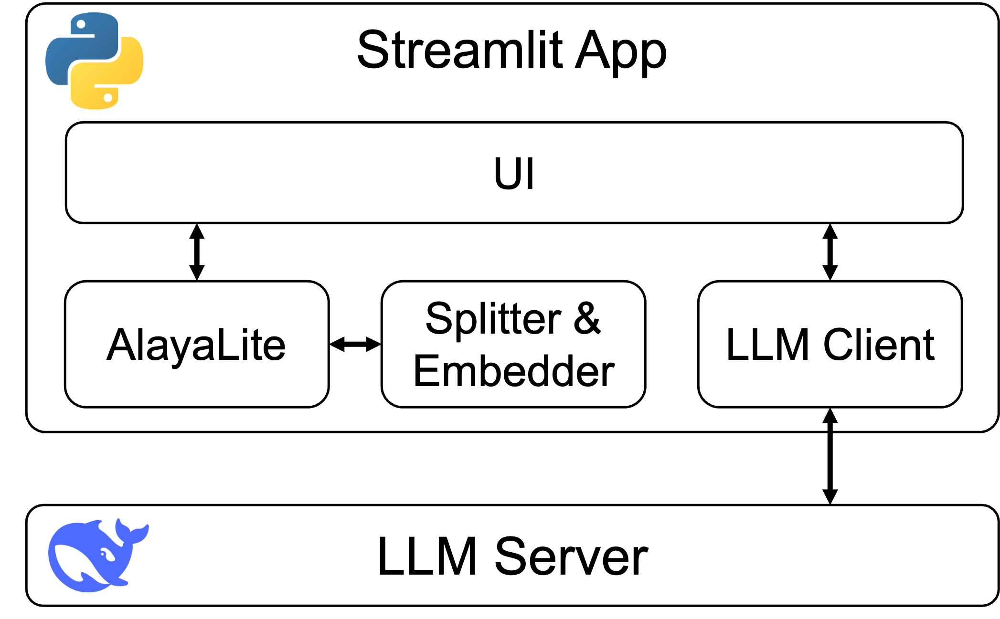
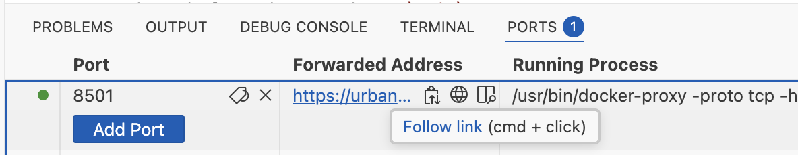
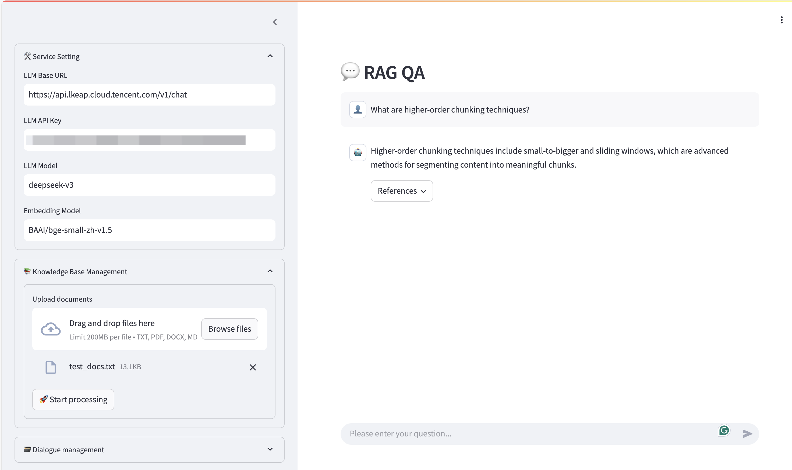

# Try Your Own RAG App with AlayaLite

This tutorial gives a step-by-step guidance to deploy a RAG web app uing AlayaLite.


## 0. Project Overview

There are only 4 core files:
- `ui.py`: Defines webpage frontend, using [streamlit](https://streamlit.io/);
- `db.py`: Includes core interfaces to manage documents. It has two key APIs: `insert_text` put text into database, and `query_text` get the related documents for the query from the database;
- `llm.py`: Creates prompt and generates response from LLM;
- `utils.py`: Includes util functions, i.e., `splitter` and `embedder`, to process text.

The overview is shown below




## 1. Setup Environment

We prepare a docker environment for you to setup the project quickly. 
`Docker` is an open source container engine.
It allows applications to run consistently across environments and platforms.

Run the following command to build an image using the given `Dockerfile` and start a container to run it:

```bash
# build image using Dockerfile at current directory
# notice the "." at the end
docker build -t try-rag-image .
```

It will take several minutes to download and install packages.
If success, you will see `Successfully tagged try-rag-image:latest`.
Then you can start a container to run it.

```bash
# create a container with the image and go into it
docker run -it -v "$(pwd):/app" -p 8501:8501 --name try-rag-container try-rag-image /bin/bash
```

Now you will see your bash prompt like `/app#`, indicating that you are inside the docker container.

<details>
<summary>If you would like to know more about docker, click me!</summary>

- Exit and close the container: `exit`
- Remove a closed container: `docker rm try-rag-container`
- Enter a running container: `docker exec -it try-rag-container /bin/bash`

See also: <a href="https://docs.docker.com/reference/cli/docker/">Docker Docs</a>
</details>


## 2. Run Your App

Run this command to launch your web application:

```bash
streamlit run ui.py
```

Your app will start at the port `8501`.
You CANNOT visit the webpage by using the URL shown in the terminal, but `Github Codespaces` will forward the service to a public location.
You can switch to the tab `PORT` to see the forwarded URL.



Open the URL, you will see the interface.
Input your LLM service URL and api key upload the files, then you can try to ask LLM about your files.
We provide a test document `test_docs.txt` for you.

```
Sample question: 
What are advanced chunking techniques?
```



```
Notice: the first time after you set/change the embedding model, the system takes some time to download it.
```